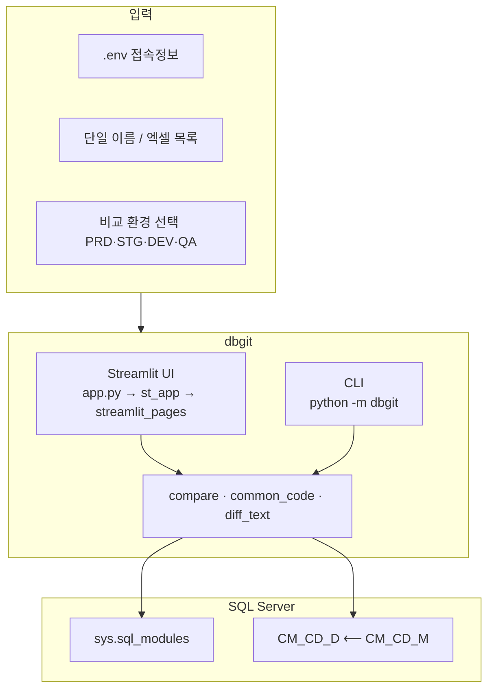

<p align="center">
  <a href="https://github.com/eunwing94/dbgit">
    
  </a>
</p>

<p align="center">
  <strong>SQL Server</strong> · 프로시저·함수 · 공통코드 <code>CM_CD_D</code><br/>
  <sub>PRD · STG · DEV · QA 멀티 환경 갭을 한 화면에서</sub>
</p>

<p align="center">
  <a href="https://github.com/eunwing94/dbgit"></a>
  <a href="https://eunwing94.github.io/dbgit/"></a>
  
  
  
</p>

---

## 목차

| | |
|:---|:---|
| [왜 dbgit?](#-왜-dbgit) | 한 줄 요약 & 대상 |
| [기능 하이라이트](#-기능-하이라이트) | 단일·일괄·공통코드 |
| [아키텍처 한눈에](#-아키텍처-한눈에) | Mermaid 다이어그램 |
| [빠른 시작](#-빠른-시작) | 설치 → `.env` → 실행 |
| [Docker](#-docker) | Compose로 컨테이너 실행 |
| [개발 테스트](#-개발-테스트) | pytest · 기여 |
| [UI / CLI](#-ui--cli) | Streamlit · 명령줄 (`--output`) |
| [공통코드 비교](#-공통코드-cm_cd_d-비교) | 상태값 · 엑셀 |
| [GitHub Pages](#-github-pages) | 정적 소개 페이지 |
| [주의사항](#-주의사항) | 보안 · 네트워크 |

---

## ✨ 왜 dbgit?

운영·개발·검증 DB에 흩어진 **프로시저 / 함수 정의**와 **공통코드 상세**가 같은지 확인하는 작업을,  
클릭 몇 번과 엑셀로 정리할 수 있게 만든 **내부용 형상 점검 도구**입니다.

<table>
<tr>
<td width="50%" valign="top">

**가능한 일**

- 환경별 **동일 객체 정의** 해시 비교 (공백·개행 차이 무시 옵션 등)
- 엑셀에 목록을 올려 **일괄 비교**
- `CM_CD_D` + `CM_CD_M` 조인으로 **공통코드 갭** 표·다운로드

</td>
<td width="50%" valign="top">

**전제**

- Microsoft **SQL Server** (`pyodbc` + ODBC Driver 18)
- 접속 정보는 **`.env`** (저장소에 커밋하지 마세요)

</td>
</tr>
</table>

---

## 🎯 기능 하이라이트

| 모드 | 설명 |
|:------|:-----|
| **단일 비교** | `object_id` 또는 `schema.object` 입력 → 환경별 SAME/DIFF, 정의 텍스트, 줄 단위 diff |
| **엑셀 일괄** | 첫 컬럼 또는 `proc` / `procedure` / `object_id` / `name` 열에서 식별자 읽기 → 요약 표 + 상세 드릴다운 |
| **공통코드** | `CM_CD_D` 행을 기준 환경과 비교 → `SAME` / `DIFF` / `MISSING_*` · `cm_cd_d_diff.xlsx` 저장 |

---

## 🏗 아키텍처 한눈에



---

## ⚡ 빠른 시작

<details open>
<summary><strong>1분 체크리스트</strong></summary>

1. 가상환경 생성 후 활성화  
2. `pip install -r requirements.txt`  
3. `cp .env.example .env` 후 각 `*_HOST`, `*_PORT`, `*_USER`, `*_PASSWORD`, `*_DATABASE` 입력  
4. macOS: **ODBC Driver 18 for SQL Server** + **unixODBC** 설치  
5. `streamlit run app.py` → 터미널에 나온 **Local URL**로 접속  

</details>

### 의존성 설치

```bash
python -m venv .venv
source .venv/bin/activate   # Windows: .venv\Scripts\activate
pip install -r requirements.txt
```

### 환경 변수 (예시 형태만)

```bash
cp .env.example .env
# 편집: PRD_HOST, PRD_PORT, PRD_USER, PRD_PASSWORD, PRD_DATABASE=ERP …
```

> 🔒 **비밀번호·계정은 Git에 올리지 마세요.** `.gitignore`에 `.env`가 포함되어 있습니다.

---

## 🐳 Docker

프로젝트 루트에서 `.env`를 준비한 뒤:

```bash
docker compose up --build
```

- 브라우저: `http://localhost:8501`  
- 로그 레벨 등은 `docker-compose.yml`의 `environment` 또는 호스트 `.env`에서 조정합니다.  
- 이미지는 **amd64 + msodbcsql18** 기준입니다. ARM 빌드 문제는 [docs/troubleshooting.md](docs/troubleshooting.md)를 참고하세요.

---

## 🧪 개발 테스트

```bash
pip install -r requirements-dev.txt
pytest
```

- 기여 가이드: [CONTRIBUTING.md](CONTRIBUTING.md)  
- ODBC·연결 오류: [docs/troubleshooting.md](docs/troubleshooting.md)

---

## 🖥 UI / CLI

### Streamlit (권장)

프로젝트 **루트**에서:

```bash
streamlit run app.py
```

브라우저는 터미널에 출력되는 주소로 열립니다 (포트는 실행 시마다 다를 수 있음).

### CLI

패키지가 `src/dbgit`에 있으므로 `PYTHONPATH`를 지정합니다.

```bash
PYTHONPATH=src python -m dbgit dbo.usp_Sample --baseline PRD --envs PRD,STG,DEV,QA
```

```bash
PYTHONPATH=src python -m dbgit 123456 --baseline PRD --envs PRD,STG,DEV,QA
```

JSON / 마크다운 출력:

```bash
PYTHONPATH=src python -m dbgit dbo.usp_Sample --output json
PYTHONPATH=src python -m dbgit dbo.usp_Sample --output markdown
```

---

## 📊 공통코드 (CM_CD_D) 비교

| 항목 | 내용 |
|:-----|:-----|
| 기준 | 선택한 **기준 환경** vs 나머지 환경 |
| 상태 | `SAME` · `DIFF` · `MISSING_IN_ENV` · `MISSING_IN_BASE` |
| 컬럼 | `TSK_SE_CD`(마스터 조인) · `DTL_CD_NM` · `SORT_NO` · `USE_YN` 등 |
| 필터 UI | SAME 숨기기 · `COMP_CD` / `CM_CD` 접두어 |
| 내보내기 | 엑셀 **요약**·**상세** 시트 (`cm_cd_d_diff.xlsx`) |

---

## 📤 엑셀 일괄 비교 (프로시저·함수)

- 첫 번째 컬럼 **또는** 컬럼명 `proc` / `procedure` / `object_id` / `name`  
- **일괄 비교 실행** 후 표에서 항목 선택 → 단일 비교와 동일한 상세·diff  

---

## 🌐 GitHub Pages

소개용 정적 페이지: **[https://eunwing94.github.io/dbgit/](https://eunwing94.github.io/dbgit/)**

> Streamlit 앱 자체는 Pages에서 실행되지 않습니다. 로컬 또는 별도 서버에서 `streamlit run app.py`를 사용하세요.

저장소 **Settings → Pages**에서 브랜치 **main**과 폴더 **`/(root)`** 또는 **`/docs`**가 `index.html` 위치와 일치하는지 확인하세요.

---

## 📝 CLI 출력 예시

```
기준 환경: PRD (dbo.usp_Sample)

환경별 결과:
- PRD: SAME (object_id=123)
- STG: DIFF (object_id=123)
- DEV: SAME (object_id=123)
- QA: DIFF (object_id=123)

차이나는 환경:
STG, QA
```

---

## ⚠️ 주의사항

| 주제 | 설명 |
|:-----|:-----|
| 보안 | DB 비밀번호는 로컬 `.env` 또는 배포 환경 시크릿에만 보관 |
| 객체 없음 | 해당 환경에 프로시저/함수가 없으면 조회 단계에서 오류 |
| 사내 DB | Streamlit Community Cloud 등 **외부 호스트**는 사내 IP DB에 연결되지 않을 수 있음 |

---

<p align="center">
  <sub>Built with Streamlit · pyodbc · pandas · ❤️</sub><br/>
  <a href="https://github.com/eunwing94/dbgit">⭐ Star on GitHub</a>
</p>
